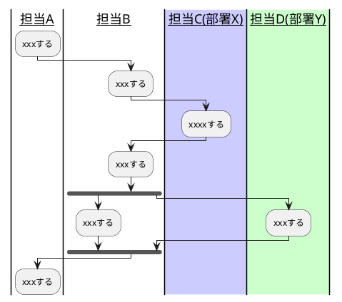

<!--
スイムレーン付きのアクティビティ図でざっくりしたフローを描く
-->
# ワークフロー
| システムID | システム名称 |
| ------ | ------ |
| phone | 電話システム |

__xxxのワークフロー__

```plantuml
@startuml
|__担当A__|
:xxxする;
|__担当B__|
:xxxする;
|#ccf|__担当C(部署X)__|
:xxxxする;
|__担当B__|
:xxxする;
fork
|__担当B__|
:xxxする;
forkagain
|#cfc|__担当D(部署Y)__|
:xxxする;
|__担当B__|
end fork
|__担当A__|
:xxxする;
@enduml
```