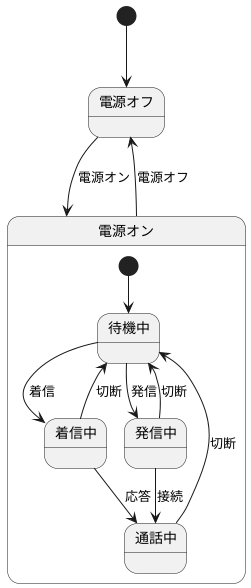

<!---
状態遷移図と状態遷移表を描く
--->
# 状態遷移分析
| システムID | システム名称 |
| ------ | ------ |
| phone | 電話システム ｜

## 状態遷移図

## 状態遷移表
| 状態\イベント | 着信  | 応答  | 発信  | 接続  | 切断  |
| ------- | --- | --- | --- | --- | --- |
| 待機中     | 着信中 | -   | 発信中 | -   | -   |
| 着信中     | -   | 通話中 | -   | -   | 待機中 |
| 発信中     | -   | -   | -   | 通話中 | 待機中 |
| 通話中     | -   | -   | -   | -   | 待機中 |
