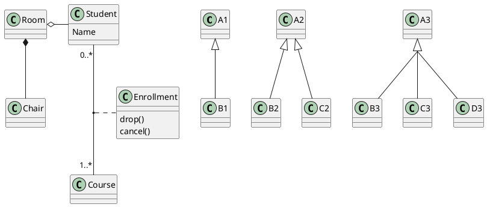

<!---
システムのクラス図を描く
--->
# クラス図
| システムID | システム名称 |
| ------ | ------ |
| phone | 電話システム |

```plantuml
@startuml
skinparam groupInheritance 3

A1 <|-- B1

A2 <|-- B2
A2 <|-- C2

A3 <|-- B3
A3 <|-- C3
A3 <|-- D3

class Student {
  Name
}
Student "0..*" -- "1..*" Course
(Student, Course) . Enrollment

class Enrollment {
  drop()
  cancel()
}

Room o- Student
Room *-- Chair

@enduml
```